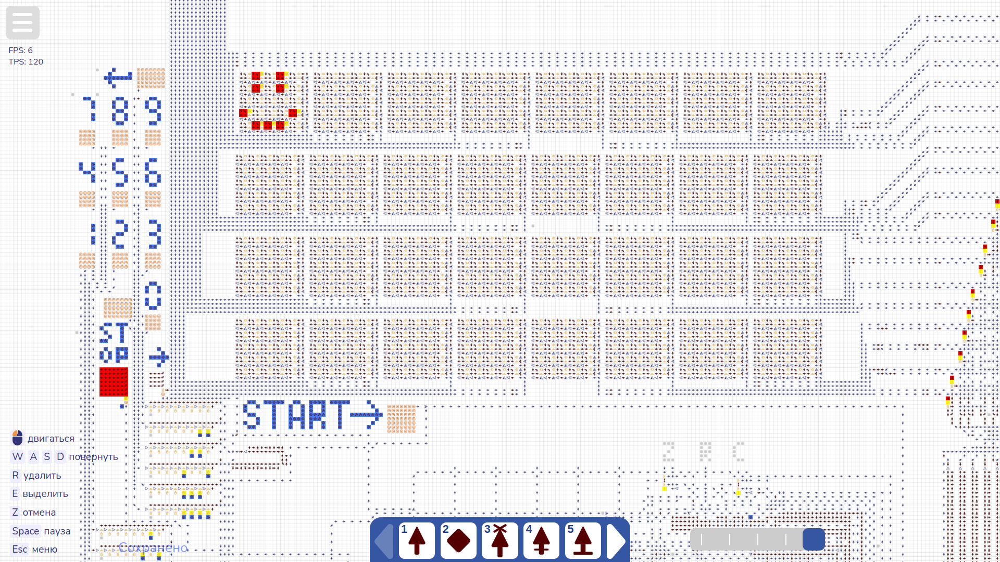
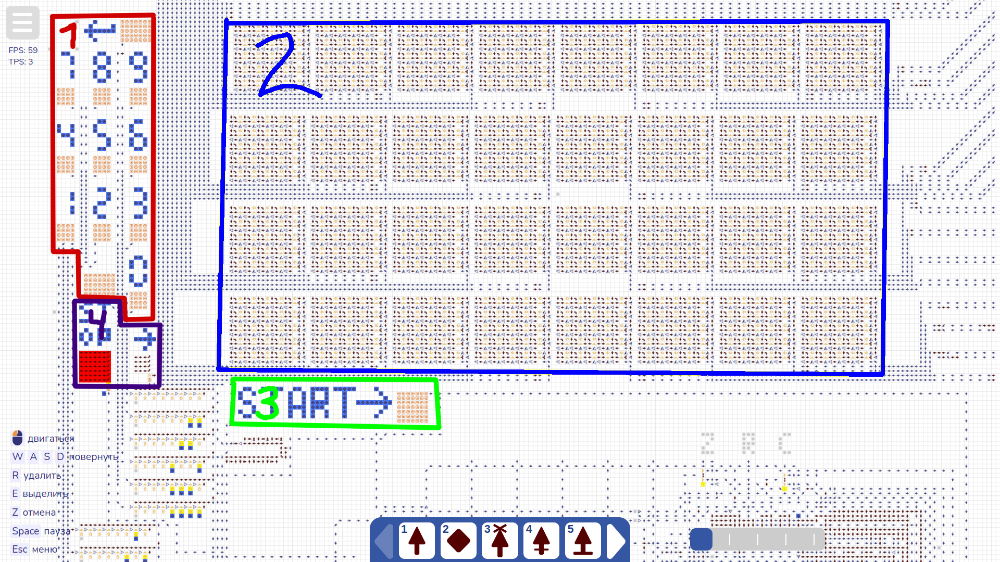

# Компьютер Smile LA | v 0.1
Первая работающая версия моего компьютера в игре "Logic Arrows" с необходимым минимумом команд и возможностей.

## Оглавление
- <a href="#start">Быстрый старт</a> 
- <a href="#about">Что это и зачем?</a> 
- <a href="#architecture">Архитектура</a> 
- <a href="#programming">Программирование</a> 
- <a href="#thanks">Благодарности</a> 

Рекомендую дочитать данный файл до конца, он предназначен для всех пользователей, вне зависимости от желаемого уровня погружения в проект.

## Быстрый старт
1. Прочтите базовый уровень <a href="#architecture">архитектуры компьютера</a>, чтобы знать, куда нажимать.
2. Откройте [эту карту в Logic Arrows](https://logic-arrows.io/map-cMzdZnXm) (рекомендую в настройках выбрать "Максимальное отдаление" на 2x или 3x, а также по желанию включить отображение FPS).  
3. Поставьте максимально возможную скорость (рекомендую использовать <a href="#thanks">расширение браузера</a> для ускорения игры).
4. Нажмите кнопку "Start" на компьютере.

## Что это и зачем?
Это тестоый компьютер для проверки возможностей Logic Arrows и понимания работы ПК изнутри. Желающих изучить этот вопрос поподробнее, а также пощупать его - приглашаю в этот репозиторий!

## Архитектура (как это работает)
Я решил, что разделю описание принципа работы на 3 уровня:
- **Базовый уровень:** Необходим для запуска ПК, здесь описывается то, что нужно знать рядовому пользователю для запуска уже вшитой программы (буквально, за что отвечает какая кнопка и лампочка).
- **Продвинутый уровень:** Неоходим для перепрошивки компьютера другими программами, представлеными в директории /examples или написанными другими пользователями, а также для желающих написать свою программу для этого ПК. Описывает процесс прошивки памяти, а также основной принцип работы.
- **Детальное описание:** Необходим для глубокого понимания работы ПК изнутри, не только внутриигрового, но и реального. Здесь я опишу всё подробно, старяясь разжевать всё как можно яснее.

Переходить к чтению следует с следующем порядке:
- Сначала базовый уровень, прочитать всем.
- Далее, те, кто хотят просто запустить другую программу, <a href="examples/README.md">читают README файл в директории /examples</a>. Позволит запускать программы, предоставленные в этом репозитории, либо же программы других пользователей.
- Кто хочет ещё и писать эти программы, читает раздел <a href="programming.md">Программирование</a>.
- Желающие же глубоко разобраться с устройством ПК - читают <a href="architecture.md">детальное описание архитектуры ПК</a>.

Т.е. читать нужно по порядку. Например, начинать сразу с детального описания не стоит, поскольку написано оно с расчётом на то, что все верхние уровни были пройдены.

**Базовый уровень:** 

На скрине вы видите ту часть компьютера, с которой работает пользователь. Я выделил области, и обозначил их номерами:
- 1 - Клавиатура. Цифры от 0 до 9, сверху Enter, снизу пробел.
- 2 - Монитор.
- 3 - Кнопка Start.
- 4 - Индикаторы. Левый ("Stop") говорит о том, процессор остановил свою работу (чаще всего программа просто окончена, реже разработчик может использовать остановку процессора как паузу, в этом случае разработчик должен как-то предупредить пользователся об этом, а пользователю нужно просто нажать кнопку Start повторно). Правый ("Ввод", обозначается стрелкой ->) говорит о том, что процессор ждёт ввода символа от пользователя. Нажмите на нужную вам клавишу на клавиатуре, только 1 раз! Двойное нажатие может привести к неправельной работе программы или процессора. В такеом случае перезагрузите карту клавишей N на вашей клавиатуре. 

## Программирование
Чтобы основной файл оставался чистым, я вынес раздел Программирование в отдельный <a href="programming.md">файл</a>.
Для программирования рекомендуется использовать ассемблер, но писать в машинных кодах тоже можно, как это сделать также описано в этом файле. 

## 🎮 Примеры программ
Здесь приведены некоторые примеры написанных мною программ. Но чтобы их запустить, сначала прочтите <a href="examples/README.md">как перепрошить память</a>. Для загрузки примеров читать раздел Программирование НЕ ТРЕБУЕТСЯ.
- <a href="examples/">Пример</a> 
- <a href="examples/">Пример</a> 
- <a href="examples/">Пример</a> 

## Благодарности

- Автор «Стрелочек» [Onigiri](https://github.com/ArtemOnigiri)
- Автор элементов, взятых мной, а также моего примера для документации [Сhubrik](https://github.com/chubrik) ([Ссылка на элементы, которые я позаимствовал](https://logic-arrows.io/map-YL7AZ6SC)) ([Ссылка на документацию к компьютеру Чубрика, на которую я опирался](https://github.com/chubrik/LogicArrows/tree/main/ru/computer-v1))
- Автор библиотеки на Python, чтобы преобразовать машинный код в вид, который можно вставть в игру (для ассемблера) [Kala-telo](https://github.com/kala-telo) ([Ссылка на библиотеку](https://github.com/kala-telo/arrows.py/blob/main/arrows.py))
- Автор расширения для браузера, ускоряющего игру (на моём железе ускорило в 2 раза) [MerinPrime](https://github.com/MerinPrime) ([Ссылка на расширение](https://github.com/MerinPrime/GraphDLC))
