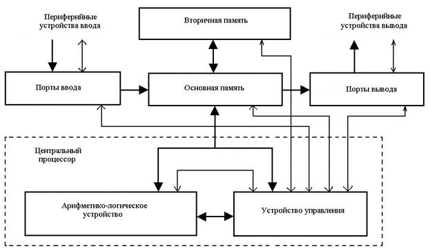

# Архитектура компьютера Smile LA | v 0.1
Здесь приведены характеристики этого ПК, а также подробно описан принци работы компьютеров.

## Оглавление
- <a href="#features">Характеристики</a> 
- <a href="#about">Что это и зачем?</a> 
- <a href="#architecture">Архитектура</a> 
- <a href="#programming">Программирование</a> 
- <a href="#thanks">Благодарности</a> 

## Характеристики
Smile LA версии 0.1 имеет следующие характеристики:
- 8-битный процессор с аккамулятороной архитектурой. 
- 256 байт памяти, из которых 17 байт - порты ввода-вывода. Память - прошиваемая (подобие ROM, но прямо в оперативке. Пока в роли эксперимента)
- Клавиатура на 12 клавиш, монитор 8 на 4 символа.
- АЛУ на сложение, вычитание и сравнение.
- Флаги Z и C.
- Ассемблер на 12 команд.

## Основы
Для начала следует пройтись по теоритической базе в целом.

Как видно на рисунке, данные с клавиатуры, мыши и микрофона подаются на порты ввода и попадают в основную паамять (оператиную). После, процессор работает с этими данными: считает их при помощи АЛУ (калькулятор внутри CPU, который позволяет производить расчёты), работает со вторичной памятью (постоянной), выводит данные на экран и динамики при помощи портов вывода. Всеми этими действиями уппавляетт УУ - именно этот элемент в процессоре разбирает  решает

## Архитектура (как это работает)
Я решил, что разделю описание принципа работы на 3 уровня:
- **Базовый уровень:** Необходим для запуска ПК, здесь описывается то, что нужно знать рядовому пользователю для запуска уже вшитой программы (буквально, что отвечает какая кнопка и лампочка).
- **Продвинутый уровень:** Неоходим для перепрошивки компьютера другими программами, представлеными в директории /examples или написанными другими пользователями, а также для желающих написать свою программу для этого ПК. Описывает процесс прошивки памяти, а также основной принцип работы.
- **Детальное описание:** Необходим для глубокого понимания работы ПК изнутри, не только внутриигрового, но и реального. Здесь я опшу всё подробно, старяясь разжевать всё как можно яснее.

Переходить к чтению следует с следующем порядке:
- Сначала базовый уровень, прочитать всем.
- Далее, те, кто хотят просто запустить другую программу, <a href="examples/README.md">читают README файл в директории /examples</a>. Позволит запускать программы, предоставленные в этом репозитории, либо же программы других пользователей.
- Кто хочет ещё и писать эти программы, читает раздел <a href="programming.md">Программирование</a>.
- Желающие же глубоко разобраться с устройством ПК - читают детальное описание.

Т.е. читать нужно по порядку. Например, начинать сразу с детального описания не стоит, поскольку написано оно с расчётом на то, что верхние уровни были пройдены.

**Базовый уровень:** Описание добавлю позже 

## Программирование
Чтобы основной файл оставался чистым, я вынес раздел Программирование в отдельный <a href="programming.md">файл</a>.
Для программирования рекомендуется использовать ассемблер, но писать в машинных кодах тоже можно, как это сделать также описано в этом файле. 

## 🎮 Примеры программ
Здесь приведены некоторые примеры написанных мною программ. Но чтобы их запустить, сначала прочтите <a href="examples/README.md">как перепрошить память</a>. Для загрузки примеров читать раздел Программирование НЕ ТРЕБУЕТСЯ.
- <a href="examples/">Пример</a> 
- <a href="examples/">Пример</a> 
- <a href="examples/">Пример</a> 

## Благодарности

- Автор «Стрелочек» [Onigiri](https://github.com/ArtemOnigiri)
- Автор элементов, взятых мной, а также моего примера для документации [Сhubrik](https://github.com/chubrik) ([Ссылка на элементы, которые я позаимствовал](https://logic-arrows.io/map-YL7AZ6SC)) ([Ссылка на документацию к компьютеру Чубрика, на которую я опирался](https://logic-arrows.io/map-YL7AZ6SC](https://github.com/chubrik/LogicArrows/tree/main/ru/computer-v1)))
- Автор библиотеки на Python, чтобы преобразовать машинный код в вид, который можно вставть в игру (для ассемблера) [Kala-telo](https://github.com/kala-telo)
