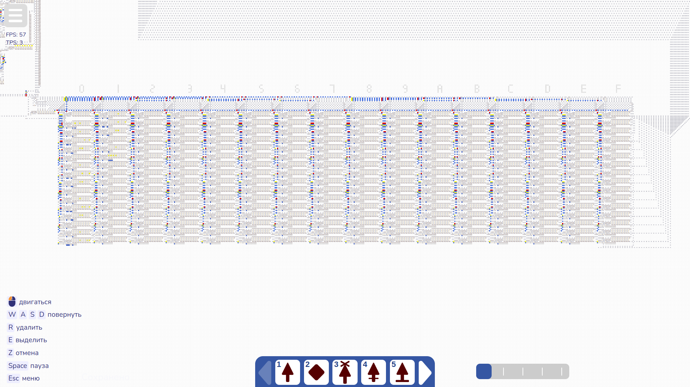

# Примеры программ для компьютера Smile LA | v 0.1
Здесь описанно, как преобразовать ассемблерный код в машинный,и как прошить память.

## Как скомпилировать исходный код
Чтобы запустить программу в компьютере, её нужно сначала скомпилировать (из кода (текста) получить нули и единички, которые потом ПК сможет обработать и запустить). Для этого откройте компилятор [в веб верии (заморожено в разработке)](), или же скачайте <a href="../compiler.py">исходный код компилятора на Python</a> и запустите его на своём компьютере (пробовал запустить в браузере, но не получилось, поэтому рекомендую всё же скачать исходник и запустить на ПК).

После запуска вы вставляете исходный код программы на ассемблере (у файлов расширение .asm), нажимаете "Скомпилировать", и просто копируете готовый код для моего компьютера (если запускаете Python версию, то просто укажите название файла (вместе с расширением), и скопируйте самый нижний текст, цифры выше - просто служебная инфрмация, чтобы вам было удобнее, некий листинг, пока нормальный не реализовал).

## Как прошить память
Чтобы прошить память, вы должны знать, где именно вы собираетесь её прошить (это предварительно должен сказать разработчик, а также адрес начала заниаемой памяти можно увидеть в первой строке исходного кода). 

Так в моём ПК выглядит оперативная память. Она разбита на 16 столбцов (от 0 до F), в каждом из которых 16 байт (от 0 до F опять же). Адрес состоит из 2-х 16-ричных цифр (от 0x00 до 0xFF). Первыя цифра - адрес стобца (они даже помечены сверху), а вторая - адрес байта в столбце (отсчитываются сверху вниз).

Если всё равно не понятно, то вот табличка, как расположены адреса:

 ⠀ | ⠀ | ⠀ | ⠀ | ⠀ 
---|---|---|---|---
0x00 | 0x10 | 0x20 | ... | 0xF0
0x01 | 0x11 | 0x21 | ... | 0xF1
0x02 | 0x12 | 0x22 | ... | 0xF2
0x03 | 0x13 | 0x23 | ... | 0xF3
0x04 | 0x14 | 0x24 | ... | 0xF4
0x05 | 0x15 | 0x25 | ... | 0xF5
0x06 | 0x16 | 0x26 | ... | 0xF6
0x07 | 0x17 | 0x27 | ... | 0xF7
0x08 | 0x18 | 0x28 | ... | 0xF8
0x09 | 0x19 | 0x29 | ... | 0xF9
0x0A | 0x1A | 0x2A | ... | 0xFA
0x0B | 0x1B | 0x2B | ... | 0xFB
0x0C | 0x1C | 0x2S | ... | 0xFC
0x0D | 0x1D | 0x2D | ... | 0xFD
0x0E | 0x1E | 0x2E | ... | 0xFE
0x0F | 0x1F | 0x2F | ... | 0xFF

Если ван нужно прошить память, которая уже записана, то сначала скопируйте трафарет пустой памяти справа (стольец из 16 строчек стен и генератора сигнала), отзеркальте его (клавишей "F" у вас на клавиатуре), а затем аккуратно поставьте его на необходимое вам место. После этого отчистить кисточку можно, наведясь на пустое место и нажав клавишу "Q" у вас на клавиатуре. Когда место записи свободно, возьмите скопированный вами машинный код из компилятора (выглядит как куча случайных символов, так и должно быть) и сочетанием "Ctrl + V" вставьте в игру. Аккуратно наведитесь на нужное вам место (машинный код должен быть встать на место стен, которые находятся в памяти) и кликните. После этого снова отчистите кисточку.

Если вы промахнулись на этапе прошивки и вставили трафарет или машинный код не туда, то просто нажмите "Z", чтобы отменить действие и вставьте повторно, на нужное вам место.

Теперь нажмите N, чтобы отчистить все сигналы на карте. Это нужно для перезапуска компьютера (без этого ПК просто сломается и всё равно потребуется перезапуск).

Всё! Память успешно прошита, можно нажимать кнопку "Start".

## Примеры
Во всех приведённых мною примерах в первых строках я написал, что программа должна делать, как ей пользоваться и другую необходимую информацию. Предполагается, что для прошивки каждой новой программмы, вы полностью отчищаете память, а после прошиваете с начала памяти (ячейки 0x01).
